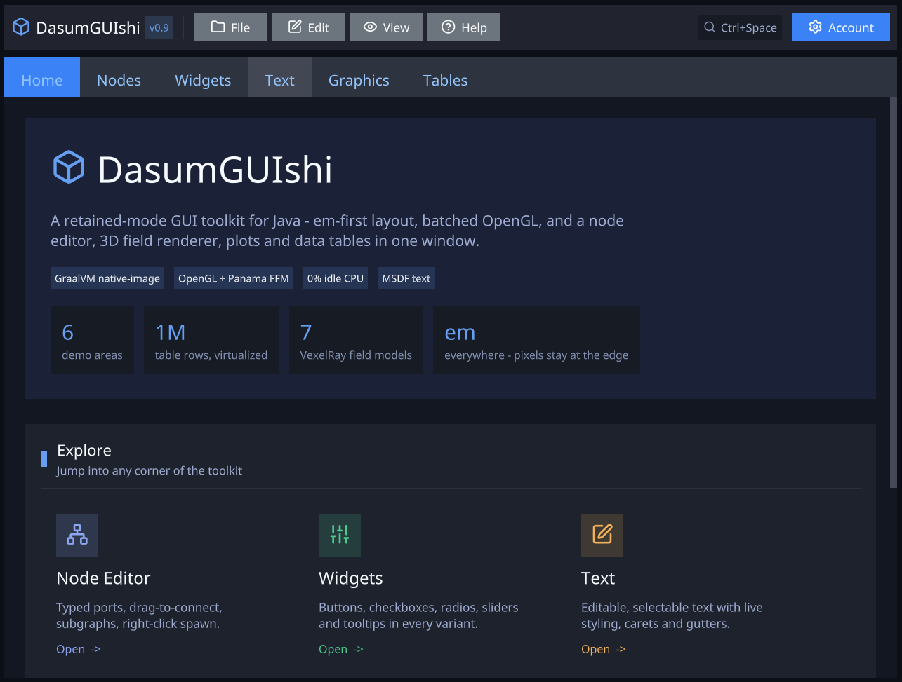
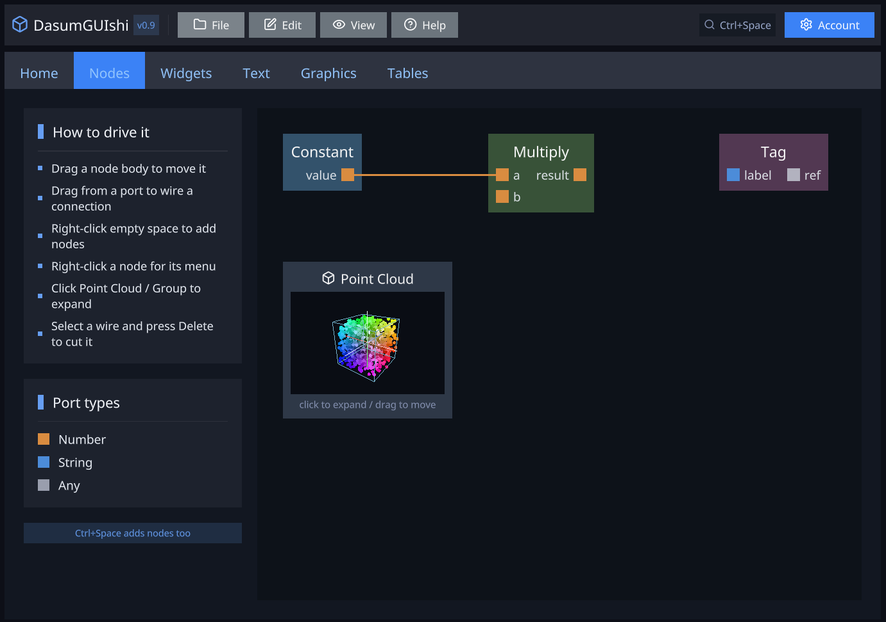
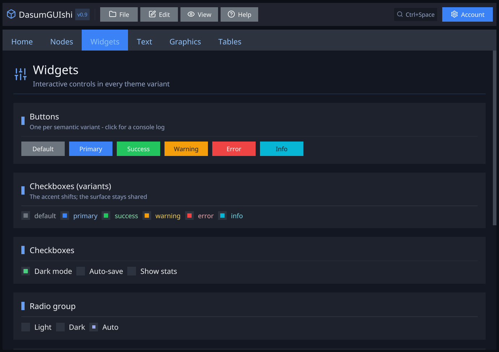
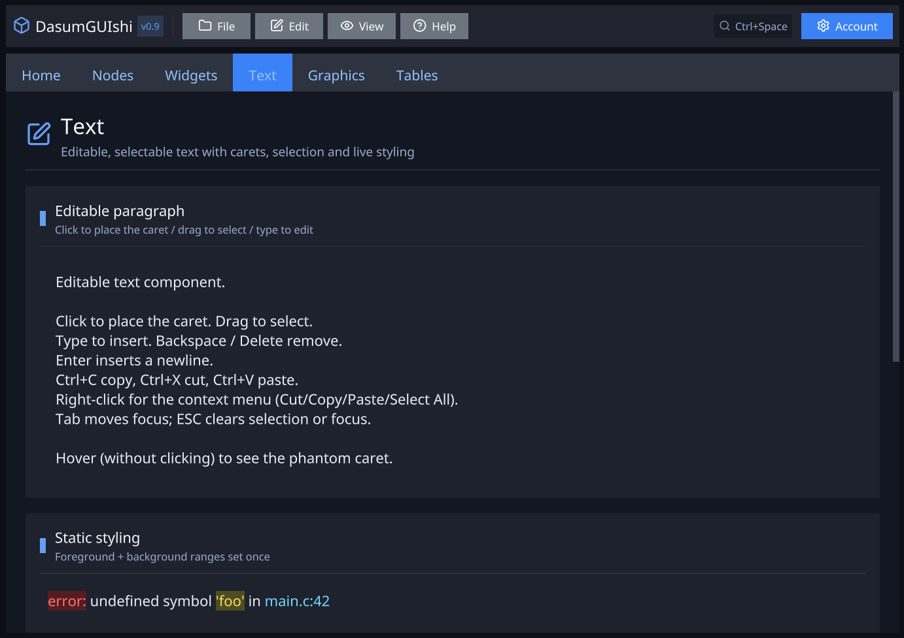
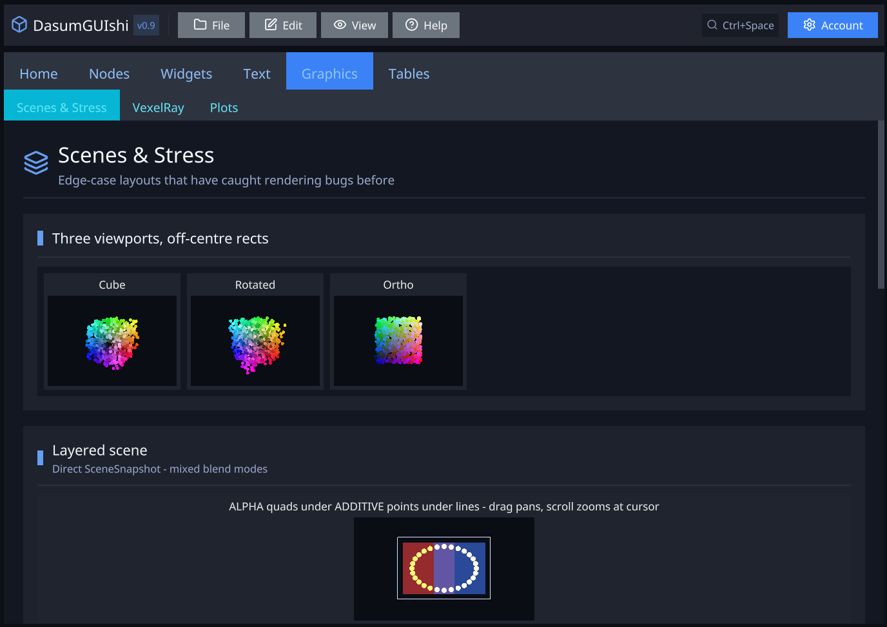
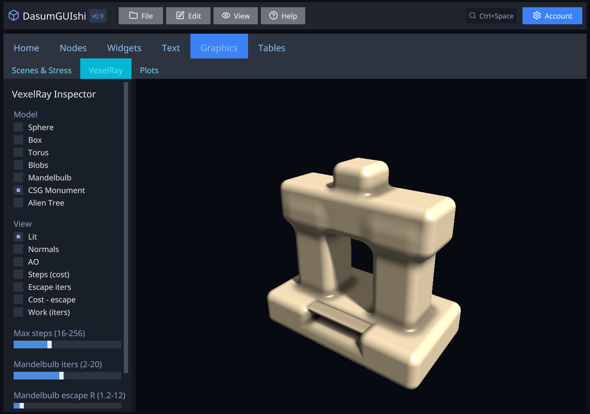
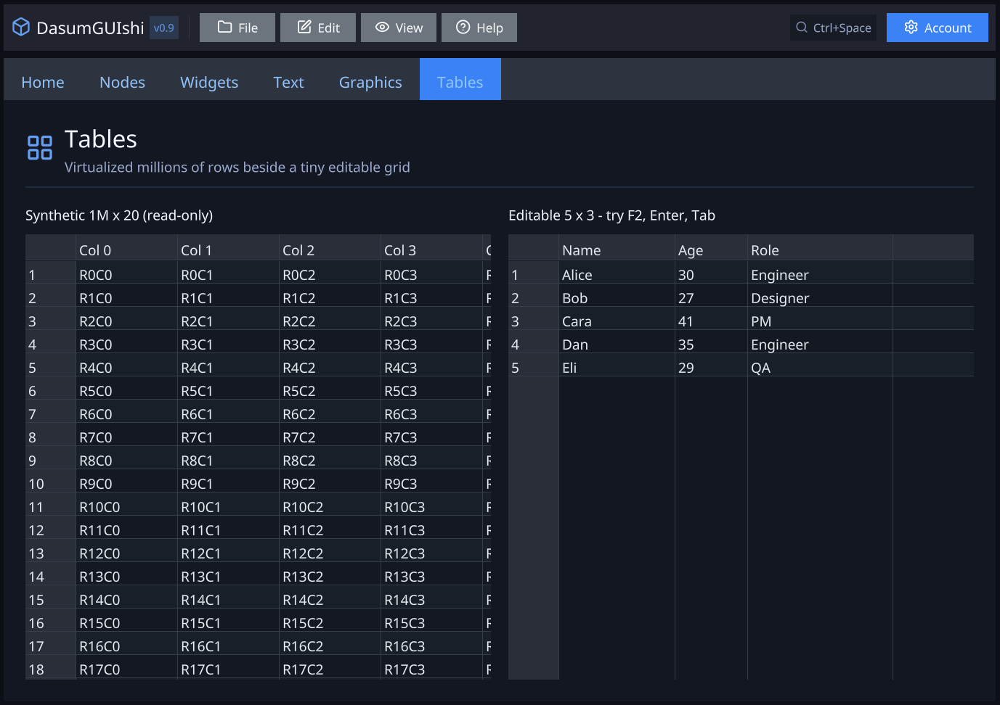

# DasumGUIshi

A small, GPU-accelerated Java GUI framework targeting GraalVM native-image. Pure Java, no reflection, single-executable deployment, zero runtime dependencies on the host system beyond a graphics driver. Designed minimalist-core, take-only-what-you-need; rendering goes through OpenGL via hand-rolled Panama bindings; text via MSDF atlases.

## Status

Pre-1.0. Demo-driven — the `dasum-mvp-demo` module is the canonical "see what works." Public APIs are stable enough to write apps against but small breaking changes happen as the design settles. Single-window only by design (no plans for multi-window).

## Screenshots

A tour of the `dasum-mvp-demo` showcase app. Every pixel — toolbar, tabs, cards, 3D viewports, tables — is drawn by the framework itself; there are no native widgets.

| | |
|---|---|
| [](docs/demo-1.png)<br>**Home** — landing page; the feature cards jump straight to each section | [](docs/demo-2.png)<br>**Nodes** — node editor with typed ports, drag-to-connect, a legend sidebar, and an embedded point-cloud viewport |
| [](docs/demo-3.png)<br>**Widgets** — buttons, checkboxes, radios and sliders across all six theme variants | [](docs/demo-4.png)<br>**Text** — editable, selectable text with carets, selection and live styling |
| [](docs/demo-5.png)<br>**Graphics › Scenes & Stress** — the layered `SceneView` renderer and edge-case stress layouts | [](docs/demo-6.png)<br>**Graphics › SDF** — raymarched signed-distance fields (here a CSG monument) with a live inspector |
| [](docs/demo-7.png)<br>**Tables** — a virtualized 1,000,000-row grid beside a small editable one | |

## Quick start

### Prerequisites

- **JDK 25** (or GraalVM 25). The build enforces this — older JDKs fail with a clear message.
- **Native-access flag at runtime**: `--enable-native-access=ALL-UNNAMED`. The demo's `exec:exec` config sets this automatically; you'll need it in your own apps too.
- **GLFW dynamic library on the runtime path.** Bundled for Windows x64 in `dasum-glfw/src/main/resources/natives/windows-x64/`. macOS / Linux users currently need to place a `glfw3.dylib` / `libglfw3.so` somewhere `NativeLibLoader` can find it (resource path or system `java.library.path`).
- **MSDF atlas tool** (`msdf-atlas-gen.exe`) bundled for Windows. macOS / Linux: activate the `msdf-prebuilt` Maven profile and place atlases at `dasum-mvp-demo/src/main/resources/dasum/atlas/` instead of regenerating.
- **File dialogs need an explicit `dasum-nfd` dependency.** The `Nfd` binding class arrives transitively via `dasum-core`, so `FileDialog` *compiles* without it — but the native binary (`nfd.dll`) lives in the separate resource-only `dasum-nfd` module, which **is not** a transitive dependency. Omit it and you get an `UnsatisfiedLinkError` at the first dialog call, not at build time. Declare it directly with `runtime` scope:

  ```xml
  <dependency>
      <groupId>sibarum.dasum.gui</groupId>
      <artifactId>dasum-nfd</artifactId>
      <scope>runtime</scope>
  </dependency>
  ```

### Build

```
mvn install
```

### Run the demo (JVM)

```
mvn -pl dasum-mvp-demo exec:exec
```

A 1280×800 window opens on a **Home** landing page. The top-level tabs are **Home**, **Nodes**, **Widgets**, **Text**, **Graphics**, and **Tables**. The Nodes tab includes a scene viewport (a point cloud) — click to expand it into a full-screen modal with orbit / zoom / point-pick. **Graphics** groups three sub-tabs: **Scenes & Stress** (the layered `SceneView` renderer — mixed blend modes, streamed images, in-scene MSDF text), **SDF** (raymarched signed-distance-field shapes — primitives, boolean CSG, a Mandelbulb, alien flora), and **Plots** (line/curve charts, complex domain colouring, a sliced 3D volume). Each card expands to full screen.

### Run the demo (native-image)

```
mvn -pl dasum-mvp-demo package -P native
./dasum-mvp-demo/target/dasum-mvp-demo
```

Produces a single executable with no JVM dependency.

## Project layout

| Module | Purpose |
|---|---|
| `dasum-natives` | Hand-rolled Panama bindings for GLFW + a minimal OpenGL 3.3 core subset. `NativeLibLoader` extracts native libs from classpath resources at startup. |
| `dasum-glfw` | Holds the GLFW dynamic library (`glfw3.dll` etc.) as a classpath resource. Split out from `dasum-natives` so the bindings can be vendored / replaced without the binary. |
| `dasum-nfd` | Native file-dialog wrapper. Exposes `FileDialog.open` / `save` / `pickFolder` backed by [nativefiledialog-extended](https://github.com/btzy/nativefiledialog-extended); the platform's native picker, not an in-process imitation. |
| `dasum-core` | The framework. All packages under `sibarum.dasum.gui.core`. See below. |
| `dasum-vis` | Optional visualization module — `Component.SceneView`, a layered 3D scene viewport: point / line / triangle / image / text layers with per-layer blend modes, plus **SDF**, a raymarched signed-distance-field layer. Orbit/pan/zoom camera, click-pick, thumbnail-or-expanded layout. Uses JOML internally, exposes immutable records. See [`dasum-vis/README.md`](dasum-vis/README.md). |
| `dasum-msdf-maven-plugin` | Build-time MSDF atlas generation. Text atlases from charset presets (optionally merging glyphs from several fonts into one atlas), icon atlases from named glyph subsets of icon fonts (Lucide / Material) with generated Java constants. See [`dasum-msdf-maven-plugin/README.md`](dasum-msdf-maven-plugin/README.md). |
| `dasum-mvp-demo` | The reference / showcase app. The best place to look when learning the API. |

### `dasum-core` packages

```
sibarum.dasum.gui.core
├── anim/        — Easing, Interpolator, Transition, Animated, AnimationManager
├── command/     — CommandRegistry + EverythingMenu (Ctrl+Space palette)
├── component/   — Component (sealed), Direction, JustifyContent, AlignItems
├── em/          — Em scalar, EmContext (root-em + zoom + DPI), EmRect
├── event/       — Invalidator (dirty-flag dynamic refresh)
├── graph/       — Node-editor primitives: GraphSurface*, Port*, Connection*, NodeBuilder, …
├── input/       — All input dispatchers and per-component state sidecars
├── json/        — Minimal JSON for the MSDF atlas metadata
├── layout/      — Layout (flex), HitTest, LayoutResult, PixelRect, Render
├── overlay/     — OverlayStack + Anchor (modal/popup mechanism)
├── reactive/    — Property<T> (observable values + subscribe)
├── render/      — Batcher, DrawCommand, materials (SolidFill, MsdfText), Color, Vec2
├── text/        — Atlas data, font groups, text metrics, glyph layout, word boundary
├── theme/       — Theme, Variant, Palette, Themed helpers
├── ui/          — Ui builder facade (row/column/box/text/scroll/button/…), LayoutLint, Diagnostic
└── window/      — GlfwContext, Window
```

## Architectural model

### Pure-data components + identity-keyed sidecars

Every visible thing is a `Component` — a Java record. Components are pure data: a `Box` is just `(width, height, padding, color, children, interactive, flexGrow)`. Layout/render/hit-test are pure functions of the component tree.

Everything mutable lives in **identity-keyed sidecars** — process-global `IdentityHashMap<Component, State>` registries:

- `ScrollStates` — per-Scroll scroll position
- `TextStates` — per-Text caret / selection / content / undo stack
- `FocusState` — globally focused component
- `HoverState` — globally hovered component
- `GraphSurfacePositions` — per-(surface,child) em position
- `GraphSurfaceChildren` — per-surface dynamic children
- `GraphSurfaceZOrder` — per-surface z-bump
- `Ports` — per-port type / direction / node
- `Connections` — per-surface connection list
- `ConnectionSelection` — globally selected connection
- `Handlers` — per-component click / focus / blur / context-menu handlers

> **Why identity, not equals.** Records implement `equals` by value, so two `Box(10, 10, 0, RED)` instances are equal but distinct. Framework lookups must use reference identity (`==`) — using `Object.equals` would conflate visually-identical instances and break per-instance state (focus, scroll, drag). The `IdentityHashMap` choice is load-bearing. **If you write framework code that looks up a component, use `==`, never `equals`.**

### Em-first coordinates

All public APIs that take coordinates use **em**, not pixels. `1em` ≈ the root font-size, scaled by zoom and DPI. `EmContext.pixelsPerEm()` is the conversion factor; `Em.toPixels()` converts.

```java
new Component.Box(Em.of(2f), Em.of(1.5f), Em.of(0.25f), Color.rgb(0.8f, 0.2f, 0.2f))
GraphSurfacePositions.set(surface, node, 5f, 3f)  // em
ScrollStates.of(panel).scrollBy(0f, 1.5f)         // em
```

Pixel-typed APIs (`scrollByPx`, `pxX()`, etc.) exist as siblings only for framework wiring that already has pixel values (the GLFW callback site, scrollbar drag math, the Layout output). App code should not need them.

> The conversion direction is em→pixels. Avoid going the other way in app code; it usually means you're trying to do layout that the framework should do for you.

### Dynamic refresh

The event loop is `glfwWaitEventsTimeout`-based. Idle = 0% CPU. State changes that affect rendering call `Invalidator.invalidate()` to schedule the next frame. The animation system invalidates per frame while animations are running, then stops.

### Two-pass batched renderer

The `Batcher` has one accumulator per material — currently `SolidFillAccumulator` (rectangles + triangles) and `MsdfTextAccumulator` (signed-distance-field glyphs). `submit(DrawCommand)` dispatches by variant. `endFrame` flushes solid fills first, then glyphs — so text always sits on top of solid backgrounds within a flush.

`OverlayStack` rendering needs explicit `batcher.flush(projection)` between z-layers (main UI → backdrop → each overlay) so a later layer's solid fills aren't drawn under earlier text. See `App.main`'s render closure for the pattern.

### Single-window

`Window.create(width, height, title)` is the only window primitive. Multi-window is deliberately out of scope (GLFW's main-thread requirement on macOS makes it painful).

## Component variants

All under `sibarum.dasum.gui.core.component.Component` (sealed):

- **`Box`** — solid-color rectangle with a fixed em size (no fill/fit path — its width/height must be concrete). Leaf, or a single-child styled container; it centers its child, so give it exactly one (multiple children overlap — the linter flags it, and `Ui.box()` enforces it).
- **`Flex`** — layout container; row or column, justify-content + align-items + gap + per-child flex-grow, optional `wrap` (ROW children that overflow the main axis reflow onto stacked rows). `width`/`height` may be `null` (fill parent) or `Em.AUTO` (fit content). The workhorse for almost every UI.
- **`Scroll`** — viewport with overflow scrolling (both axes). Mouse-wheel + scrollbar drag; wheel routing walks the scroll chain so a bottomed-out inner scroll bubbles to its parent.
- **`Text`** — text-rendering primitive. Optional `selectable` / `editable` / multiline / clip / wrap-width / phantom-cursor on hover. Per-range foreground (glyph tint) and background color spans, plus MSDF outline and weight effects, via `TextStyle` + `TextStyleStates` (used for syntax highlighting). The foundation of every label and input.
- **`Checkbox`** — bound to a `Property<Boolean>`.
- **`Radio<T>`** — bound to a shared `Property<T>` (group-exclusive).
- **`Slider`** — horizontal or vertical, bound to a `Property<Float>`.
- **`Tabs`** — tab strip with header cells, content panes, active-index bound to a `Property<Integer>`. Tabs that don't fit the strip width collapse into an overflow ("…"/chevron) menu, so all tabs stay reachable when the window is small.
- **`GraphSurface`** — 2D positioning container for the node editor. Children float at em positions from `GraphSurfacePositions`. Distinct from a future drawing-canvas component (which would be called `Canvas`).
- **`SceneView`** — leaf 3D viewport whose scene (a list of blend-mode layers) and camera live in `SceneStates` (in `dasum-vis`). The variant lives in `dasum-core` so layout / hit-test treat it as a first-class component; the renderer is registered via `CustomRenderers` from `dasum-vis` so `dasum-core` stays 2D-only. See [`dasum-vis/README.md`](dasum-vis/README.md).
- **`DataTable`** — virtualized spreadsheet-style grid backed by a `DataTableSource`; selection / scroll / edit / hover state in `DataTableStates`. Rendered via `CustomRenderers` like `SceneView`, treated as a leaf for layout / hit-test.

Variants are immutable; instance methods like `Flex.withFlexGrow(int)` return a new record with the field changed.

## Building UIs — the `Ui` builder (recommended)

Components are plain records, so you *can* call their constructors directly — but the raw constructors are long and positional (`Flex` has 12 args), and two `null`s mean opposite things: a `null` width means "fill the parent", while a `null` color is a latent crash in the render pass. The `sibarum.dasum.gui.core.ui.Ui` builder is the recommended front-end — "Dasum on training wheels". It makes the correct layout the default, fails fast with a labelled message when something is wrong, and lints the finished tree for the mistakes the compiler can't catch. It produces the **same records**, so builder-made and hand-written subtrees mix freely and you can adopt it incrementally.

### Fluent builders

```java
import sibarum.dasum.gui.core.ui.Ui;

Component panel = Ui.column().named("settings").padding(Em.of(1f)).gap(Em.of(0.5f))
    .add(Ui.text("Settings").size(Em.of(1.4f)))
    .add(Ui.row().gap(Em.of(0.5f))
        .add(Ui.button("Save").variant(Variant.PRIMARY).onClick(() -> save()))
        .add(Ui.spacer())                 // transparent flexible gap; pushes the next child right
        .add(existingComponentRecord))    // interop: drop any record straight in
    .build();
```

Entry points: `Ui.row()`, `Ui.column()`, `Ui.box()`, `Ui.text(str)` / `Ui.label(str)`, `Ui.scroll(child)`, `Ui.button(str)`, plus the pattern helpers `Ui.spacer()`, `Ui.hairline()`, and `Ui.section(title, body)`. Every default is non-null and safe: transparent background, zero padding/gap, `START` justify, `CENTER` (row) / `STRETCH` (column) align, empty children, `grow = 0`.

### Sizing vocabulary

A flex child's size is the framework's #1 footgun: a child with a `null` **main-axis** size measures to **0** and collapses — that's how a column of cards ends up stacked at the same `y`. The builder replaces raw nullable sizes with intent-named methods and **defaults both axes to fit-content**, so this can't happen by accident (cross-axis filling still happens for free via the parent's `STRETCH`):

| method | meaning | maps to |
|---|---|---|
| `.fit()` | size to children (default) | `Em.AUTO` |
| `.fill()` | fill the parent on both axes | `null` |
| `.grow(n)` | take a share of leftover main-axis space | `flexGrow = n` |
| `.width(em)` / `.height(em)` | a fixed extent | `Em.of(…)` |

Use `.fill()` at the root and `.grow(1)` on the one elastic region (content area, scroll, table); leave the default `.fit()` for content stacks.

### Interop and refactoring

`build()` returns the plain record, and `.add(...)` takes either a record or another builder — so migration is mechanical and partial trees can stay hand-written. `Ui.from(record)` lifts an existing record back into a builder for fluent editing (a uniform alternative to the scattered `withX` methods):

```java
Component.Flex tweaked = (Component.Flex) Ui.from(existingFlex)
    .background(Color.TRANSPARENT)
    .gap(Em.of(1f))
    .build();
```

### Fail-fast records

The record constructors themselves now validate their crash-prone fields — a `null` color, a `null` padding/gap, a `null` (or null-element) children list, a negative `flexGrow`, a `Slider` with `min >= max`, a sizeless `Box` — and throw an `IllegalArgumentException` naming the field **at construction**, instead of a `NullPointerException` several frames later in the renderer. This guards hand-written records too, so the safety survives dropping below the builder. The legitimate `null` sentinels (fill width/height, `Text.wrapWidth`, empty `Scroll` child, `Tabs.onTabPressed`) are preserved.

```java
new Component.Flex(null, null, Em.ZERO, null, /* … */);
// IllegalArgumentException: Flex color is null; use Color.TRANSPARENT for no fill
```

### Layout lint — the "training wheels"

`Ui.check(root)` returns a `List<Diagnostic>`; `Ui.lint(root)` throws on the errors and logs the warnings (strict by default — `Ui.lenient()` downgrades errors to logging). Run it once per rebuild in development to catch legal-but-wrong layouts before they render as broken pixels:

```java
Component root = buildUi();
Ui.lint(root);   // throws IllegalStateException with a readable path if a node is misconfigured
```

The linter walks any tree — builder-made or hand-written — and flags: a `Box` with more than one child (they overlap), a collapse-prone `fill`/`grow=0` flex child, a `justify` that a growing child makes a no-op, an explicit cross-axis size that `STRETCH` silently ignores, a `Scroll` whose child can never overflow, `wrap` on a column, and a fixed parent its fixed children overflow. Each diagnostic carries a path (`root > column 'home' > row#2`), the problem, and a fix hint; attach `.named("…")` to a builder to make the path readable. Example output:

```
ERROR  column 'root' > column 'card' : this Flex has height=null (fill) with grow=0 inside a
       COLUMN - as a measured child it collapses to 0 and overlaps its siblings
       (fix: call .fit() (size to content), .grow(1) (take leftover space), or set an explicit height)
```

## Subsystems

### Input

GLFW callbacks land in `App.wireInput` (or your equivalent), which dispatches through a chain of static controllers — each returns `true` to consume:

```
ScrollbarController → TabsController → ConnectionDragController →
GraphSurfaceController → ConnectionSelectionController →
OverlayStack handling → default hover-based dispatch
```

State sidecars (`HoverState`, `FocusState`, `InputState`) track the current mouse / focus state. `Handlers.onClick(component, runnable)` registers per-component handlers; the dispatcher walks the hit path leaf-to-root, bubbling.

### Theme

`Theme.of(Variant)` returns a `Palette` for one of six built-in variants: `DEFAULT`, `PRIMARY`, `SUCCESS`, `WARNING`, `ERROR`, `INFO`. `Themed.button(...)`, `Themed.checkbox(...)`, `Themed.tabs(...)` are convenience factories that produce variant-styled components, each with a one-call overload that also wires the handler/subscriber (avoiding a stranded-handler bug — see the `Ui.button(...).onClick(...)` terminal). `Theme.override(variant, palette)` lets apps replace any palette.

```java
// Palette: .base() (fill), .emphasis() (text tint), .onBase() (text on the fill)
Palette p = Theme.of(Variant.PRIMARY);

// A button with its click wired in one call
Component ok = Themed.button("OK", Em.AUTO, Variant.SUCCESS, 0, () -> confirm());

// The bound widgets — each takes a Property and an optional onChange consumer
Property<Boolean> enabled = new Property<>(true);
Component check = Themed.checkbox(Em.of(1.1f), enabled, Variant.PRIMARY, v -> System.out.println("enabled=" + v));

Property<Float> volume = new Property<>(50f);
Component slider = Themed.slider(Direction.ROW, Em.of(12f), Em.of(1f), Em.of(0.6f), volume, 0f, 100f, Variant.INFO);

Property<Integer> activeTab = new Property<>(0);
Component tabs = Themed.tabs(
    null, null, Em.of(2.4f), Em.of(1f), Em.ZERO, Em.of(1f),
    List.of(new Component.Tabs.TabPanel("Overview", overviewPane),
            new Component.Tabs.TabPanel("Details",  detailsPane)),
    activeTab, Variant.PRIMARY);
```

When more tabs are open than fit the strip width, the extras spill into a "…" menu at the right edge (opt into a themed chevron via `Tabs.withOverflowGlyph(...)`), so every tab stays reachable at any window size.

### Overlay (modal dialogs, popups, command palette)

`OverlayStack.push(new Overlay(component, anchor, modal, onDismiss))` stacks an overlay on top of the main UI. Modal overlays draw a backdrop and route input exclusively. Click-outside-modal pops automatically. `Anchor.CENTER` and `Anchor.at(emX, emY)` are the positioning options; `At` is clamped to the viewport.

```java
Component dialog = Ui.column().padding(Em.of(1f)).gap(Em.of(0.5f))
    .background(Color.rgb(0.12f, 0.14f, 0.18f))
    .add(Ui.text("Delete this node?"))
    .add(Ui.row().gap(Em.of(0.5f))
        .add(Ui.button("Cancel").onClick(OverlayStack::pop))
        .add(Ui.button("Delete").variant(Variant.ERROR).onClick(() -> { delete(); OverlayStack.pop(); })))
    .build();

OverlayStack.push(new OverlayStack.Overlay(
    dialog, Anchor.CENTER, /* modal */ true, () -> System.out.println("dismissed")));
```

### Command palette

`CommandRegistry.register(id, label, runnable)` registers a command. `EverythingMenu` (Ctrl+Space) opens a fuzzy-searchable list. Same flow used by built-in commands ("Zoom In") and app commands ("Add Constant Node").

```java
CommandRegistry.register("view.zoom.in", "Zoom In", () -> EmContext.multiplyZoom(1.1f));
CommandRegistry.register("node.add.constant", "Add Constant Node", () -> spawnConstant());
// Ctrl+Space, type "zoom" → the command surfaces; Enter runs it.
```

### Reactive

`Property<T>` is the framework's observable. `.get()`, `.set(value)`, `.subscribe(consumer)`. Used everywhere a UI value needs to be bound: checkbox state, slider value, active tab index, etc. `.set(...)` dedupes equal values (equal → no notification), so binding it to the render path is cheap.

```java
Property<Integer> activeTab = new Property<>(0);
activeTab.subscribe(i -> System.out.println("switched to tab " + i));
activeTab.set(2);   // notifies subscribers and schedules a repaint; set(2) again is a no-op
```

### Animation

`anim/` provides easing functions, an `Interpolator`, and `Transition` / `Animated` for declarative tweens. `AnimationManager` ticks active animations per frame and stops invalidating when none are running. Coexists with `Property` — animate by changing the property's value over time.

```java
// An animated float, eased over 0.3s
Animated<Float> opacity = new Animated<>(0f, Interpolator.FLOAT,
    Transition.tween(0.3f, Easing.EASE_OUT_CUBIC));

opacity.set(1f);          // starts animating; registers with AnimationManager + invalidates
float current = opacity.get();   // read the interpolated value each frame while building the tree
```

`AnimationManager.tick(System.nanoTime())` runs once per frame in the event loop; built-in interpolators cover `FLOAT`, `DOUBLE`, `VEC2`, and `COLOR`.

### Em context

`EmContext` is process-global state: `rootEmPx` (default 16), `zoom`, `dpiScale`. `pixelsPerEm() = rootEmPx × zoom × dpiScale`. Set DPI scale at startup from `Window.contentScaleX()`. Ctrl+= / Ctrl+- / Ctrl+0 in the demo bind to `multiplyZoom` / `setZoom(1f)`.

### Data tables

`Component.DataTable` is a virtualized, spreadsheet-style grid — only the visible rows/cells are laid out, so a million-row source scrolls smoothly. Back it with a `DataTableSource` (implement `rowCount` / `columnCount` / `valueAt` / `header` / `canEdit` / `trySet` …); selection, scroll, edit, and hover state live in `DataTableStates`.

```java
Property<TableSelection> selection = new Property<>(null);  // TableSelection.cell/block/rows/columns/all()
Component table = new Component.DataTable(null, null, mySource, selection).withFlexGrow(1);
TableContextMenu.registerDefaults(table);   // optional Copy/Cut/Paste/insert/delete right-click menu
```

The 4-arg constructor fills sensible dark-theme defaults (header height, row height, gutter width, colors); the full constructor exposes all of them. `dasum-files`'s `DirectoryTableSource` is a worked example of a real-world source.

### Scene visualization (`dasum-vis`)

Optional module — depend on `dasum-vis` to render 3D scenes inside any GUI panel. Each viewport is a `Component.SceneView`; its scene is a `SceneSnapshot` — an ordered list of layers (points, lines, triangles, images, in-scene MSDF text) each with a blend mode, plus **SDF** layers that raymarch a signed-distance field (analytic primitives, boolean CSG box programs, fractals, folded-IFS shapes). Scene + camera + interaction state are held in per-component `AtomicReference`s in `SceneStates`, so worker threads can publish data (typical for ML / training visualizations) without blocking the render thread; GPU uploads are skipped per layer when a layer reference is unchanged. Drag-orbit / pan, scroll-zoom (cursor-anchored in 2D mode), click-pick. The same `SceneView` instance can move between a thumbnail and a modal overlay via `DynamicChildren` — scene, camera, and GPU buffers all follow the component identity. The legacy `PointCloudStates` API still works as a thin compat layer over `SceneStates`. JOML lives entirely inside `dasum-vis`; the public API is immutable records. See [`dasum-vis/README.md`](dasum-vis/README.md).

### Icon fonts

`dasum-msdf-maven-plugin` accepts an `<icons>` block per atlas. Point it at an icon font's TTF + manifest (Lucide `info.json`, Material `codepoints`, etc.), list the icons you actually use by name, and the plugin bakes a focused atlas + generates a Java `Icons` class with one `public static final int` per glyph. The icon atlas registers as a second `FontGroup` (default name `"icons"`) at app startup; `Icon.of(Icons.SEARCH, em, color)` produces a `Component.Text` that renders the glyph. See [`dasum-msdf-maven-plugin/README.md`](dasum-msdf-maven-plugin/README.md) for the manifest formats, name-normalization rules, and the collision policy.

### Context menus

Per-component opt-in via `Handlers.onContextMenu(component, provider)`. Provider returns `List<ContextMenuItem>` at right-click time (so items can reflect current state). Two built-in defaults:

- **`TextContextMenu.defaultProvider()`** — auto-applied to any selectable Text with no explicit provider. Cut / Copy / Paste / Select All.
- **`PortContextMenu.registerDefaults(node)`** — opt-in helper for graph nodes. Adds a "Disconnect" item to every port on the node.

Right-clicks resolve **innermost-out**: deepest hit first, falling back outward through ancestors. The first registered provider wins.

```java
Handlers.onContextMenu(node, event -> List.of(
    new ContextMenuItem("Rename", () -> rename(node)),
    ContextMenuItem.separator(),
    new ContextMenuItem("Delete", () -> delete(node))));
```

## Node editor

The headline use case the framework's been built around. Live in `graph/` + a few input controllers.

### `GraphSurface`

A 2D positioning container. Children float at em positions stored in `GraphSurfacePositions`. Dragging a child rewrites its position. Z-order via `GraphSurfaceZOrder.bumpToTop` (clicked child moves to front). Dynamic children added at runtime live in `GraphSurfaceChildren`; the framework walks the combined declared + dynamic list for layout / render / hit-test.

### Ports

A "port" is just a regular component (typically a small `Box`) marked via `Ports.declare(node, portComponent, type, direction, name)`. The framework's identity-keyed lookup makes a port discoverable from any handler that has its component reference.

- **`PortType`** — open registry; apps create their own. The framework supplies `PortType.ANY` (wildcard, connects to anything).
- **`PortDirection`** — `INPUT`, `OUTPUT`, `BIDIRECTIONAL`. Bidirectional is for graph-shaped relationships that aren't a data flow.

### Connections

`Connections.add(surface, fromPort, toPort)` registers a connection after passing three rules:

1. Direction (at least one end can output AND at least one can input).
2. Type (`PortTypeCompat.check(out, in)` — defaults to ANY-or-exact-id-match, override globally).
3. Application (`ConnectionRule.check(out, in)` — defaults to always-allow, override globally for arbitrary rules like same-node block, cycle prevention, fan-in limits).

Connections render as cubic Beziers with horizontal handles via `ConnectionRenderer`. Per-vertex color gradient from source port's color to target's.

### Drag-from-port-to-port

`ConnectionDragController` claims left-press on a port, draws an in-flight curve to the cursor, validates the drop target via `Connections.canConnect`, calls `Connections.add` on release. Visual feedback: gradient when over a compatible target, red tip when incompatible, faded when free-floating.

### Selection + deletion

Click a curve → `ConnectionSelectionController` selects it (a white halo around the stroke). Delete or Backspace removes it. Right-click on a port → "Disconnect" via `PortContextMenu` removes everything incident on that port.

### NodeBuilder

```java
Component multiply = NodeBuilder.titled("Multiply")
    .input(NUMBER, "a")
    .input(NUMBER, "b")
    .output(NUMBER, "result")
    .background(new Color(0.22f, 0.32f, 0.22f, 1f))
    .build();
```

Sugar that produces a fit-to-content node with title at top, inputs on the left, outputs on the right, bidirectional ports along the bottom. For non-standard layouts (circular nodes, ports on top edges, custom port visuals), build the node tree by hand and call `Ports.declare` on each port directly.

## Writing an app

Smallest functional app — a window with a button that prints to stdout:

```java
public final class HelloApp {
    public static void main(String[] args) {
        try (GlfwContext ctx = GlfwContext.init();
             Window window = Window.create(640, 480, "Hello");
             Batcher batcher = new Batcher();
             CursorManager cursors = new CursorManager(window.handle().address())) {

            Gl.load();
            batcher.init();
            cursors.init();
            EmContext.setDpiScale(window.contentScaleX());

            try (Texture atlasTex = Texture.fromPngResource("/dasum/atlas/primary.png")) {
                AtlasData atlas = AtlasData.loadFromResource("/dasum/atlas/primary.json");
                FontGroups.register(FontGroup.of(FontGroups.DEFAULT, atlas, atlasTex));

                Component root = Ui.column().fill()
                    .padding(Em.of(1f)).background(new Color(0.1f, 0.1f, 0.12f, 1f))
                    .justify(JustifyContent.CENTER).align(AlignItems.CENTER)
                    .add(Ui.button("Click me").variant(Variant.PRIMARY)
                        .onClick(() -> System.out.println("Clicked")))
                    .build();

                Ui.lint(root);   // dev-mode: fail fast on layout mistakes (optional)

                // …wire input callbacks (see dasum-mvp-demo/App.wireInput for the pattern)
                // …run the EventLoop
            }
        }
    }
}
```

Look at **`dasum-mvp-demo/src/main/java/sibarum/dasum/gui/demo/App.java`** for the full pattern — toolbar + tabs + node editor + text input + every widget the framework offers.

## Extending

### A custom widget

The component sealed type is `permits`-restricted, so you can't add a new variant from outside `dasum-core`. Compose from `Flex` / `Box` / `Text` / etc. — via the `Ui.*` builders — and register click/focus/context handlers with `Handlers`. This gets you 90% of "custom widgets" in practice:

```java
static Component chip(String text, Runnable onClick) {
    Component c = Ui.row().padding(Em.of(0.3f)).background(Color.rgb(0.2f, 0.22f, 0.28f)).interactive(true)
        .add(Ui.text(text).size(Em.of(0.85f)))
        .build();
    Handlers.onClick(c, onClick);
    return c;
}
```

### A custom 3D / GPU component

If you need a new component variant that draws via OpenGL outside the 2D batcher (3D scenes, mesh viewers, custom shaders), add the variant to `Component`'s sealed `permits` clause and register a `CustomRenderers.Renderer` for it from a separate module. The renderer receives the component, its layout rect, the batcher, and the 2D projection; it queries the current `glViewport` directly (rather than being passed framebuffer dimensions) and is responsible for flushing the batcher, scissoring/viewport-ing to its rect, drawing, and restoring GL state. `dasum-vis` packages this dance in a `ViewportScope` (try-with-resources) and a debug `GlStateGuard` (`-Ddasum.debug.gl=true`) that flags any leaked GL state; its `SceneRenderer` is the worked example.

### A custom port type

```java
public static final PortType AUDIO = PortType.of("my.audio", "Audio", new Color(0.4f, 0.8f, 0.6f, 1f));
```

That's it. Use it in `NodeBuilder.input(AUDIO, "in")` or `Ports.declare(node, port, AUDIO, PortDirection.INPUT)`. Auto-compatible with itself and with `PortType.ANY`.

### Custom connection rules

```java
// Block cycles in your domain
ConnectionRule.override((out, in) -> !wouldCreateCycle(out, in));

// Type-level subtype relationships
PortTypeCompat.override((outType, inType) -> isAssignable(outType, inType));
```

Process-global. Set once at startup.

### Custom node spawning

Wrap a node-building lambda in a `Supplier<Component>` and bind it to a command:

```java
Supplier<Component> myNode = () -> NodeBuilder.titled("My Node")
    .input(NUMBER, "in")
    .output(NUMBER, "out")
    .build();

CommandRegistry.register("node.add.mynode", "Add My Node",
    () -> spawnOnto(surface, myNode.get(), defaultEmX, defaultEmY));
```

Spawned node appears via `GraphSurfaceChildren.add(surface, node)` plus `GraphSurfacePositions.set(...)`. See `App.spawnNode` for the full helper.

## Conventions to know

- **Identity, never equals, for component lookups.** Records compare by value; framework state is identity-keyed.
- **All public coordinates are em.** Don't introduce pixel-typed parameters on app-facing APIs. Use `Em.toPixels()` only at render/layout boundaries.
- **Context menus are opt-in.** Only selectable/editable Text gets a default. Everything else needs explicit `Handlers.onContextMenu`.
- **Hover indication is automatic for interactive components,** *except* `Tabs` (does its own per-cell hover) and `GraphSurface` (interactive for hit-testing, not a clickable surface).
- **Avoid AWT and ImageIO under native-image.** Use `PngDecoder` (in `render/`) for PNGs; clipboard goes through `Glfw.glfwGetClipboardString` / `glfwSetClipboardString`.
- **Missing glyphs are logged.** If text is drawn with a printable character absent from its font atlas, it renders as the missing-glyph box and an error is logged to stderr — once per (atlas, codepoint) — with the codepoint, its Unicode name, and a stack trace pointing at the render/measure site. If you see one, add the character to the atlas `<charset>` (see the MSDF plugin) or render that text with a font group that includes it.
- **Use `Em.AUTO`, not `null`, when you mean "fit to content."** `null` width/height means "fill the parent's available extent," and as a *measured flex child* it collapses to zero. The `Ui` builder handles this for you (`.fit()` / `.fill()` / `.grow()` default to fit-content); prefer it, or run `Ui.lint(root)` to catch the mistake.
- **Prefer the `Ui.*` builder for new UI.** It defaults to safe layouts, fails fast on null crash-fields, and lints structural mistakes. Raw record constructors and `Ui` interoperate freely, so mixing and migrating are cheap.

## Native-image notes

The demo's `native` profile produces a static executable via `org.graalvm.buildtools:native-maven-plugin`. Build args live in `src/main/resources/META-INF/native-image/native-image.properties` (so they're picked up automatically). Reachability metadata for the framework's FFM types is hand-derived; if you see `NoClassDefFoundError` for a Panama-related type in a native build, add it there.

Things to avoid in native-image:
- `java.awt.*`, `javax.imageio.*` (use `PngDecoder` and the MSDF atlas instead)
- Reflection-based serialization (use the framework's `json/Json` for simple cases)
- Dynamic classloading

## License

See `LICENSE.txt`.
